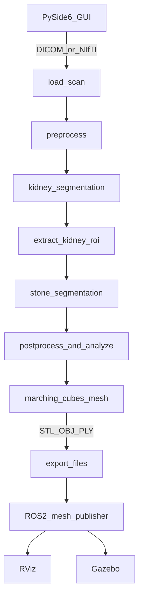

# Kidney Stone Detection — Adım Adım Öğrenme Planı

Dokümandaki 3D CT pipeline'ını adım adım, sen yazıp anlayacak şekilde kuruyoruz: önce saf Python (`kidney_stone_ai/`) + GUI ile DICOM/NIfTI yükleme; M1–M5 tamamlandıktan sonra bağımsız bir ROS2 paketiyle Gazebo/RViz’de organ ve taş mesh’lerini göstereceğiz. Ask modunda tam kod paylaşılır; bir adım bitmeden sonrakine geçilmez.

Kaynak tasarım: [`kidney_stone_detection.md`](kidney_stone_detection.md)

## İlerleme

| Adım | Konu | Durum |
|------|------|--------|
| 0 | venv + iskelet + `main.py` | Tamamlandı |
| 1 | `load_scan` (DICOM + NIfTI) | Tamamlandı |
| 2 | HU clip, resample, normalize | Tamamlandı |
| 3 | PyVista volume viewer | Bekliyor |
| 4 | PySide6 GUI dosya yükleme | Bekliyor |
| 5 | TotalSegmentator böbrek segmentasyonu | Bekliyor |
| 6 | Kidney ROI crop + margin | Bekliyor |
| 7 | Stone segmentation iskeleti (geçici HU/CCA) | Bekliyor |
| 8 | Post-process + taş ölçümleri (M4) | Bekliyor |
| 9 | Mesh + STL export + mesh viewer (M5) | Bekliyor |
| 10 | Bağımsız ROS2 paketi → RViz + Gazebo | Bekliyor |
| 11 | Gerçek stone model eğitimi | Sonra |

## Çalışma şekli (sabit kural)

- Her oturumda **tek bir adım**.
- Ask modunda o adımın tam kodu, klasör yapısı ve “neden böyle” açıklaması paylaşılır.
- Kodu sen yazarsın, çalıştırırsın, anladığını teyit ederiz.
- Adım tamamlanmadan (çalışıyor + anlaşılıyor) sonraki adıma geçilmez.
- Kodlar `ct_to_mesh_ros2` ile **bağımsız**; oradan kopyalama yok.
- Klinik kullanım iddiası yok; araştırma/prototip.

## Hedef mimari



İki katman:

1. **`kidney_stone_ai/`** — saf Python: yükleme, AI, ölçüm, mesh, GUI
2. **ROS2 paketi** (sonra) — dışarıdan üretilen mesh’leri Gazebo/RViz’e basma (pipeline’dan bağımsız)

## Proje iskeleti

```
kidney_stone_ai/
├── app/                 # PySide6 GUI
├── ai/
├── preprocessing/
├── postprocessing/
├── mesh/
├── visualization/
├── models/
├── data/                # örnek DICOM / NIfTI (gitignore)
├── requirements.txt
└── main.py
```

Stack: Python 3.11+, SimpleITK, nibabel, pydicom, numpy, scipy, scikit-image, PyVista, trimesh, PySide6; böbrek için TotalSegmentator; taş için sonra nnU-Net/MONAI.

---

## Adımlar (sıra kilitli)

### Adım 0 — Ortam + paket iskeleti

- venv, `requirements.txt` (önce hafif paketler; TotalSegmentator/PyTorch sonra)
- Boş modül klasörleri + `main.py` “hello”
- `data/` altına DICOM ve `.nii.gz` örneklerini koyma kuralı
- **Çıkış kriteri:** `python main.py` çalışır → `folder check: OK`

### Adım 1 — Tek giriş arayüzü: `load_scan` (M1 çekirdeği)

- Dosyalar: `preprocessing/dicom_reader.py`, `nifti_reader.py`, ortak `load_scan(path) -> volume, affine, spacing, origin`
- DICOM series klasörü **veya** tek `.nii`/`.nii.gz`
- Metadata kaybı yok (spacing, orientation, origin, affine)
- Küçük CLI/test: shape, spacing, HU min/max yazdır
- **Çıkış kriteri:** Hem DICOM hem NIfTI ile volume yükleniyor

### Adım 2 — Preprocessing

- HU clip (−200…1500 başlangıç), resample (ör. 1×1×1 mm), normalize
- `resampling.py`, `normalization.py`
- Affine/spacing güncellemesi doğru kalsın
- **Çıkış kriteri:** Aynı CT için öncesi/sonrası shape+spacing karşılaştırılabilir

### Adım 3 — Basit 3D görüntüleme (GUI’siz önce)

- PyVista ile volume slice / orthogonal view
- `visualization/volume_viewer.py`
- **Çıkış kriteri:** Yüklenen CT pencerede görünüyor

### Adım 4 — PySide6 GUI: dosya yükleme

- `app/` ana pencere: “DICOM klasörü seç” / “NIfTI seç” / yükle / slice kaydır
- GUI → `load_scan` → (şimdilik) viewer
- **Çıkış kriteri:** Arayüzden DICOM ve NIfTI yüklenebiliyor

### Adım 5 — Böbrek segmentasyonu (M2)

- TotalSegmentator ile left/right kidney mask
- `ai/kidney_segmentation.py`
- Mask’ı viewer’da overlay
- **Çıkış kriteri:** Sol/sağ böbrek maskesi üretiliyor ve görünüyor

### Adım 6 — Kidney ROI crop

- Bounding box + 20–30 voxel margin
- Sol/sağ ayrı ROI
- **Çıkış kriteri:** Tam CT yerine küçük ROI volume’ları oluşuyor

### Adım 7 — Taş segmentasyonu iskeleti (M3 — önce kural/heuristik)

- Dataset hazır olana kadar: ROI içinde yüksek HU eşik + connected components ile geçici “stone candidate”
- Sonra gerçek model (nnU-Net/MONAI) ile değiştirme
- **Çıkış kriteri:** `segment_stone(roi)` arayüzü sabit; en az bir aday maske üretiyor

### Adım 8 — Post-process + taş analizi (M4)

- Threshold, CCA, gürültü filtresi
- Her taş: volume (mm³), diameter, centroid, bbox, mean/max/min HU, laterality
- GUI’de tablo/özet
- **Çıkış kriteri:** En az bir taş için sayısal rapor doğru spacing ile hesaplanıyor

### Adım 9 — Mesh + export (M5)

- Marching Cubes → (opsiyonel) smooth/simplify → STL/OBJ/PLY
- Böbrek yarı saydam, taş opak (PyVista mesh viewer)
- GUI’den export
- **Çıkış kriteri:** `kidney.stl` / `stone.stl` dosyaları üretiliyor

### Adım 10 — ROS2 paketi (bağımsız görselleştirme)

- Yeni ROS2 Python paketi: mesh dosyası yolu parametre/service ile alınır
- Marker / mesh resource → **RViz**
- Aynı mesh’ler için **Gazebo** spawn
- GUI “ROS2’ye gönder” = dosya yaz + node tetikle (sıkı coupling yok)
- **Çıkış kriteri:** Export edilen böbrek/taş RViz + Gazebo’da görünüyor

### Adım 11 (ileride) — Gerçek stone model eğitimi

- Label standardizasyonu, patient-level split, Dice+Focal, stone-positive sampling
- nnU-Net benchmark + MONAI 3D U-Net
- Placeholder eşik yöntemini model ile değiştirme

---

## Sonraki oturum

**Adım 3:** PyVista volume viewer — ask modunda tam kod paylaşılacak.
